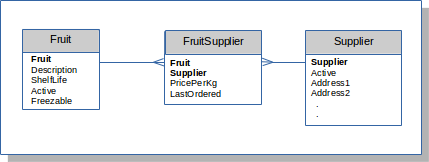
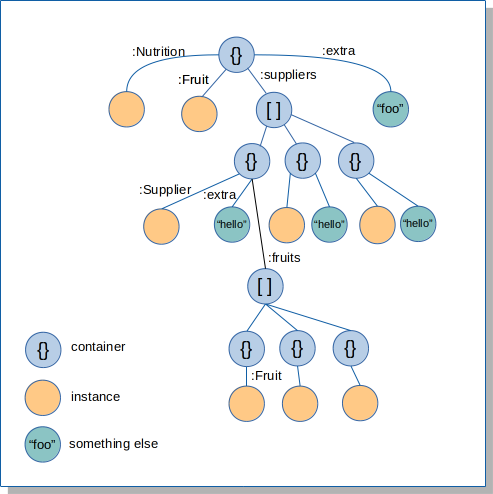

# entity-core

A Clojure library for defining domain types, their keys and persistence
bindings. In future, lifecycle management within transactions. Can be used
with `entity-sql` when the persistence mechanism is a SQL database.
Uses `typeops` to maintain purity of domain type instances.

Types are denoted by name-spaced keywords; scalars, enums and entities
are supported.

## Define Scalars
```clojure
(ns fruits.model.common
  (require [entity.core :refer :all]))

(defscalar :fin/Money 0.00M)   ; type is decimal accurate to 2dp
=> :fin/Money

(defscalar :foo/LongName "")   ; type is string
=> :foo/LongName

(defscalar :foo/NumDays 0)     ; type is long
=> :foo/NumDays

(defscalar :foo/DateTime (java.util.Date.))
=> :foo/DateTime
```

## Define Enums
Enums define keyword to value mappings and a default value
```clojure
(defenum :foo/Freezable {:y "Y"
                         :n "N"} :y)

(defenum :foo/Active {:y 1
                      :n 0} :y)
```


## Define Entities
```clojure
(ns fruits.model.fruit
  (require [fruits.model.common] ; drag in common types
           [fruits.model.config :refer [*fruit-db* fruit-db-opts]]
           [entity.sql.hug :as sql]
           [entity.core :refer :all]))

(defentity :foo/Fruit
           [Fruit          ""
            Description    :foo/LongName = nil
            ShelfLife      :foo/NumDays
            Active         (enum-val :foo/Active :y)
            Freezable      (enum-val :foo/Freezable :n)]
           [Fruit]
           :keys {:all          {:unique? false
                                 :cached? true
                                 :fields  []}
                  :by-freezable {:unique? false
                                 :cached? true
                                 :fields  [Freezable]}
                  :filter       {:unique? false
                                 :cached? false
                                 :fields  [Fruit
                                           Active :as FruitActive]}}
           :io (sql/bind-connection *fruit-db* "sql/fruit.sql" fruit-db-opts)
           :create (fn [instance] (comment stuff))
           :mutate (fn [old new] (comment stuff))
           :join (fn [instance] (comment stuff))
           :destroy (fn [instance] (comment stuff)))
```
The fields of an entity is a vector of names and types (or values that infer
the type), with an optional default value. If no default value is present the field
takes the value of the type reference. Values (inferring the type or the default)
can be a literal, reference to a scalar or an expression.

Every entity must have a primary key, which defines its uniqueness
in the application domain. This is a vector whose content must
be names of fields the entity defines. All other elements are optional.

An entity is implemented as a record: `(defentity ...)` will
emit `(defrecord ...)` for the specified fields.

## Defining Keys
Any number of additonal keys, unique or otherwise, can be defined using the `:keys`
argument. This is a map defining the fields, uniqueness and cached status of each
key
> NOTE: `unique?` and `cached?` are not presently used.

The example above defines the key `:filter` as having two fields, both native
to the entity. `Active` is renamed in the key as `FruitActive`. This is to cater
for those cases where the underlying retrieval mechanism joins between entities
that both define a field called `Active`. Consider the following example:



Perhaps we want to define a `:filter` key to support queries for `FruitSupplier`
instances, wild-carding the fruit and supplier, according to whether a fruit and supplier is
active and whether an order was placed in a particular date range. This would be
declared like so:

```clojure
           :keys {
                    .
                    .
                  :filter {:unique? false
                           :cached? false
                           :fields  [Fruit
                                     Supplier
                                     :foo/Fruit.Active :as FruitActive
                                     :foo/Supplier.Active :as :SupplierActive
                                     LastOrdered :as FromDate
                                     LastOrdered :as ToDate
                                     :foo/Fruit.Freezable
                                     :foo/Fruit.ShelfLife :as MinShelfLife
                                     :foo/Fruit.ShelfLife :as MaxShelfLife]}
```
The SQL to apply this key could be:
``` sql
SELECT
 FS.Fruit          AS "Fruit",
 FS.Supplier       AS "Supplier",
 FS.PricePerKg     AS "PricePerKg",
 FS.LastOrdered    AS "LastOrdered"
FROM FruitSupplier FS,
Fruit F,
Supplier S
WHERE F.Fruit = FS.Fruit
AND   S.Supplier = FS.Supplier
AND (FS.Fruit = :Fruit OR :Fruit IS NULL)
AND (FS.Supplier = :Supplier OR :Supplier IS NULL)
AND (F.ShelfLife >= :MinShelfLife OR :MinShelfLife IS NULL)
AND (F.ShelfLife <= :MaxShelfLife OR :MaxShelfLife IS NULL)
AND (F.Active = :FruitActive OR :FruitActive IS NULL)
AND (S.Active = :SupplierActive OR :SupplierActive IS NULL)
AND (F.Freezable = :Freezable OR :Freezable IS NULL)
AND (FS.LastOrdered >= :FromDate OR :FromDate IS NULL)
AND (FS.LastOrdered <= :ToDate OR :ToDate IS NULL)
```

All keys, including the `:primary`, return instances of the entity only. Any aggregations
with other domain data types should be expressed by associating related
instance(s) via their position in a dynamically constructed data graph.

By default, key field values are nil. `typeops` is used to enforce
the correct types for field values set its definition of `assoc`.
```clojure
(make-key
    :foo/FruitSupplier
    :filter
    {})
=>
{:ToDate nil,
 :MaxShelfLife nil,
 :Freezable nil,
 :MinShelfLife nil,
 :Supplier nil,
 :FruitActive nil,
 :SupplierActive nil,
 :Fruit nil,
 :FromDate nil}
```
In order for the types to be known, fields declared using references
to other types, like `foo/Supplier.Active`, require those entities to be
present when the key is used.

Key fields can be defined with a default value other than `nil`:
```clojure
     .
     .
   foo/Supplier.Active :as SupplierActive = (enum-val :foo/Active :y)
     .
```

## The Mighty (aggregate)
In any data model there are many relationships between the various entities.
When defining a part of the processing model, a subset of those relationships
will be navigated to build an appropriate structure, expressing them by the
relative positions of the instances:
- siblings in a map: 1-to-1
- nested vector: 1-to-many

Consider the following example



The second-level maps allow relationships to be expressed at that level, an so on
deeper into the structure.

This structure can be built using `aggregate` like this:
```clojure
      (-> {}
          (aggregate :to :foo/Fruit :key-val {:Fruit "Strawberry"})
          (aggregate :to :foo/Supplier
                     :from [:Fruit]
                     :instance-name
                     :Supplier
                     :set-name :suppliers
                     :key-val :by-fruit)
          (aggregate :to :foo/Nutrition
                     :from [:Fruit]
                     :for-each (fn bar [v] (assoc v :extra "foo")))
          (aggregate :to :foo/Fruit
                     :for-each (fn foo [v] (assoc v :extra "hello"))
                     :from [:suppliers > :Supplier]
                     :key-val :by-supplier
                     :set-name :fruits))))
```
This is saying
- starting at the `:Fruit` Strawberry
- aggregate all the suppliers of Strawberry
- add in also Strawberry's associated `:Nutrition` info and at the same time
the additional thing `"foo"`
- aggregate each `:Supplier`'s inventory of `:Fruit`s and at the same time the
additional thing `"hello"`

The `(aggregate data & opts)` function is the way to build data graphs from your
entity model that express the relationships required by whatever part of the
processing model you are currently concerned with.

opts are as follows:

+ `:from path` a vector path to the thing being aggregated from.
This is only absent when seeding the structure
with its initial value (or vector of values, in the
case of a non-unique key). When passing through
a vector in the structure indicate this using `>`

+ `:to type-ref` mandatory - the type being joined in the structure.

+ `:key-val` when `:from` is present, by default it will be used
as the value for the target type's `:primary` key, however
this behaviour is overridden by key-val, which may
be either the return value of make-key or a vector tuple
of `[key-name key-value]`, a keyword identifying a
known key or a function (see below).

+ `:instance-name` the map key to use when placing single instances in the
structure. This applies whether the key being applied
is unique or not. The name will be used in all
map children housing each instance. Optional and if
absent the unqualified name or any alias is used.

+ `:set-name` the map key for the vector returned by non-unique keys
when placed in the parent map. Mandatory when a non-unique
key is being used, otherwise ignored.

+ `:merge` Any existing value will always be replaced by a new one.
In the case of a non-unique key, an existing vector
will be replaced unless this option specifies
either `:primary` or a function. The option of `:primary`
will merge current and new values into the result
vector by the primary key set. A function must accept
three arguments, the instance-name, current and new
vectors, and return a vector containing the required merge.

+ `:must-join` If true, when aggregating to a vector, the map child will
be removed for any instances that don't join with the
target. Otherwise the vector entry remains with a
nil child where there is no join.

+ `:for-each` A function called after the aggregation. Will be passed
the parent node and must return the new child.

## I/O Mechanisms
The `entity-sql` library implements `core`'s `IO` protocol and provides
the `bind-connection` macro to bind entities to SQL databases.

## Usage

Not presently hosted. Use `lein install` to place in your local maven
repo for now and use the version found in `project.clj` for your
dependency.

## License

Copyright © 2017 Inqwell Ltd

Distributed under the Eclipse Public License either version 1.0 or (at
your option) any later version.
